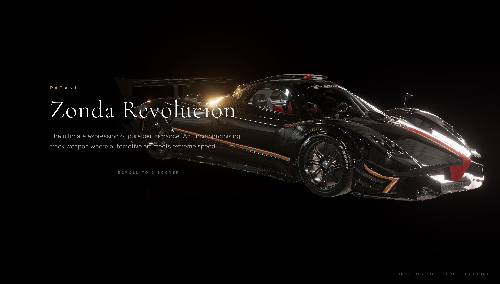

# Hey there :wave: ! I'm Shrinath Hinge
[](https://wakatime.com/@8ee7d4a8-c269-4e25-9a4b-e97a7ee42eb3)

## Weekly Development Breakdown

<!--START_SECTION:waka-->

```txt
Total Time: 1 hr

JavaScript   26 mins               ██████████▓░░░░░░░░░░░░░░   43.24 %
JSON         22 mins               █████████▒░░░░░░░░░░░░░░░   37.39 %
YAML         8 mins                ███▓░░░░░░░░░░░░░░░░░░░░░   14.50 %
Markdown     2 mins                █▒░░░░░░░░░░░░░░░░░░░░░░░   04.81 %
CSS          0 secs                ░░░░░░░░░░░░░░░░░░░░░░░░░   00.06 %
```

<!--END_SECTION:waka-->


<!-- PROJECT-TABLE-START -->
## Projects <sup>5</sup> ↘️

<table>
<tr>
<td align="center">
<a href="https://parkfolio-three.vercel.app/"></a><br/>⎯⎯⎯⎯<br/>
<strong>Portfolio</strong><br/>
<a href="https://parkfolio-three.vercel.app/">Live</a>
</td>
<td align="center">
<a href="https://github.com/ULTRASIRI/Three-js-Journey"></a><br/>⎯⎯⎯⎯<br/>
<strong>ThreeJs Journey</strong><br/>
<a href="https://github.com/ULTRASIRI/Three-js-Journey">Code</a>
</td>
<td align="center">
<a href="https://github.com/ULTRASIRI/POS-system-for-Gargi-Garage"></a><br/>⎯⎯⎯⎯<br/>
<strong>POS system for Garage</strong><br/>
<a href="https://github.com/ULTRASIRI/POS-system-for-Gargi-Garage">Code</a>
</td>
</tr>
<tr>
<td align="center">
<a href="https://focus-and-concentration.vercel.app/"></a><br/>⎯⎯⎯⎯<br/>
<strong>Focus And Concentration</strong><br/>
<a href="https://github.com/ULTRASIRI/Focus-and-Concentration">Code</a> · <a href="https://focus-and-concentration.vercel.app/">Live</a>
</td>
<td align="center">
<a href="https://pagani-zonda-revolucion-three.vercel.app/"></a><br/>⎯⎯⎯⎯<br/>
<strong>Pagani Zonda Revo</strong><br/>
<a href="https://github.com/ULTRASIRI/zondaR-3D">Code</a> · <a href="https://pagani-zonda-revolucion-three.vercel.app/">Live</a>
</td>
<td align="center"><br/>⎯⎯⎯⎯<br/><strong>Coming Soon</strong><br/><a href="https://github.com/ULTRASIRI">Stay tuned</a></td>
</tr>
</table>
<!-- PROJECT-TABLE-END -->

## :snake: Contribution Snake

